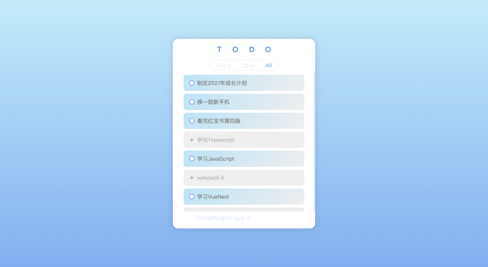
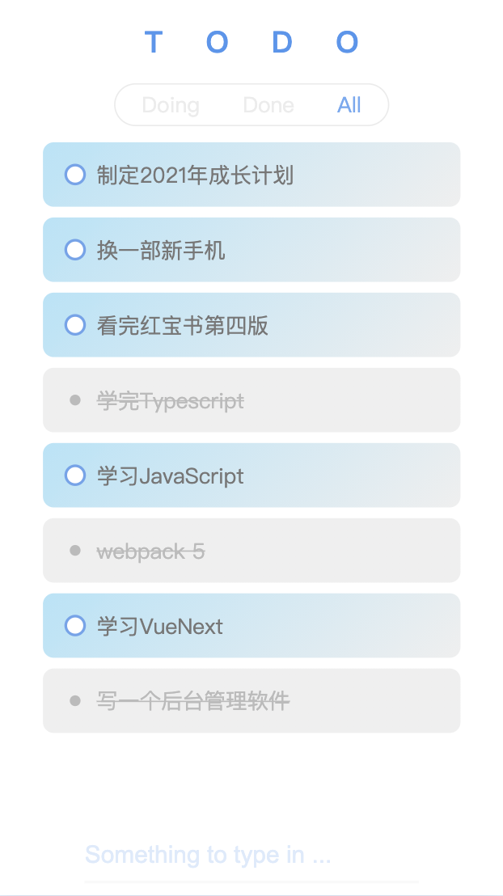

<div style="text-align:center;" align="center">

# Todo


</div>

## 说明

`todo`是一个使用 React、 Typescript 构建的应用，主要用于练习数据管理工具的使用以及最佳实践。仓库中不同分支包含了不同的实现方式，主要包括 redux 和 mobx 两大类，你可以 clone 代码然后切换到指定分支查看实现方式

| 分支    | 说明                                                                                 |
| ------- | ------------------------------------------------------------------------------------ |
| master  | 使用传统的基于 connect 链接 redux 以及 react 组件的方式                              |
| hooks   | 使用基于 hooks 的方式组织代码 `react>16.8` 并且`react-redux>7.1.0`                   |
| RTK     | 使用基于[redux tookit](https://www.npmjs.com/package/@reduxjs/toolkit)组织的代码结构 |
| mobx-V6 | 基于 mobx-v6 的数据管理实现，采用传统的 inject 的方式，而不是 hooks                  |

## Building and running on localhost

clone repository to local

```zsh
git clone https://github.com/hec9527/todo
cd todo
```

install dependence

```zsh
yarn
```

To start your server

```zsh
yarn start
```

To create a production build

```zsh
yarn build
```

## Running

Open the file `dist/index.html` in your browser

## screenshots

<div style="display:flex;">



</div>

## LICENSE

[MIT](./LICENSE)
